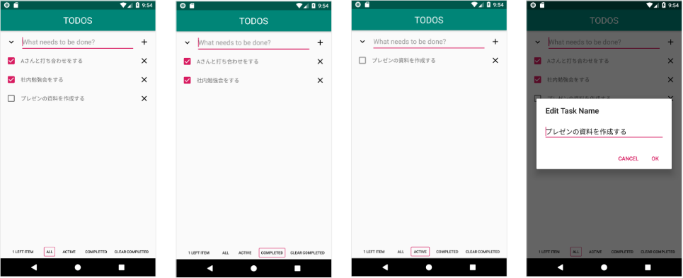

## このプロジェクトの概要

[TodoMVC](<http://todomvc.com/>)のようなTODOアプリをAndroidとKotlinで開発しているプロジェクトです。

## このプロジェクトの技術
- [MVVM](https://developer.android.com/jetpack/docs/guide)
- [Android Architecture Component](https://developer.android.com/topic/libraries/architecture)
- [moshi](https://github.com/square/moshi)

